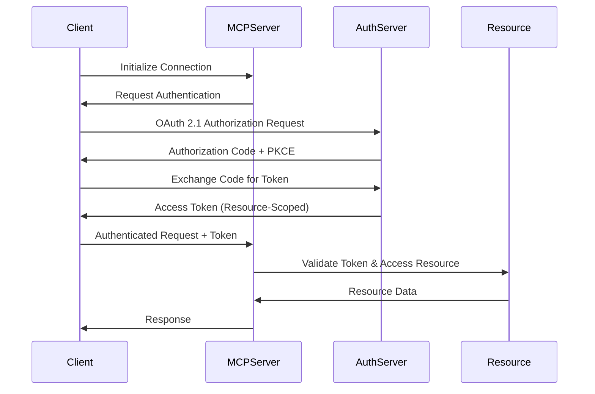

# MCP Server Architecture for Sartor Claude Network

## Executive Summary

This document outlines the architecture for a comprehensive Model Context Protocol (MCP) server implementation for the Sartor Claude Network. The design follows MCP specification v2025-03-26 and incorporates industry best practices for security, scalability, and maintainability.

## Table of Contents

1. [MCP Protocol Overview](#mcp-protocol-overview)
2. [Server Architecture](#server-architecture)
3. [Tool Specifications](#tool-specifications)
4. [Security Design](#security-design)
5. [Error Handling Strategy](#error-handling-strategy)
6. [Integration Architecture](#integration-architecture)
7. [Performance Considerations](#performance-considerations)

## MCP Protocol Overview

### What is MCP?

The Model Context Protocol (MCP) is an open standard introduced by Anthropic in November 2024 to standardize how AI systems integrate with external tools, systems, and data sources. It provides a universal protocol for connecting AI assistants to the systems where data lives.

### Core Primitives

MCP defines five core primitives:

1. **Tools**: Enable LLMs to perform actions (API calls, computations, system operations)
2. **Resources**: Expose structured contextual information (files, logs, data schemas)
3. **Prompts**: Provide structured messages and instructions for LLM interactions
4. **Sampling**: Allow servers to delegate LLM inference to clients
5. **Roots**: Define navigation entry points for resource hierarchies

### Communication Protocol

MCP uses JSON-RPC 2.0 over various transport mechanisms:
- **stdio**: Standard input/output streams (recommended for local servers)
- **HTTP/SSE**: Server-Sent Events for web-based implementations
- **WebSocket**: For bidirectional real-time communication

## Server Architecture

### High-Level Architecture Diagram

```
┌─────────────────────────────────────────────────────────────────┐
│                        MCP CLIENT (Claude)                       │
├─────────────────────────────────────────────────────────────────┤
│                     JSON-RPC 2.0 Protocol Layer                  │
└────────────────────┬───────────────────────────┬────────────────┘
                     │                           │
              stdio/SSE Transport          Authentication
                     │                           │
┌────────────────────▼───────────────────────────▼────────────────┐
│                    SARTOR MCP SERVER                             │
├──────────────────────────────────────────────────────────────────┤
│  ┌──────────────────────────────────────────────────────────┐   │
│  │                   Request Router                          │   │
│  │  • Tool Handler    • Resource Handler    • Prompt Handler │   │
│  └──────────────┬────────────────┬─────────────┬───────────┘   │
│                 │                │             │                 │
│  ┌──────────────▼──────┐  ┌─────▼──────┐  ┌──▼──────────┐     │
│  │   Firebase Service  │  │GitHub Service│ │Onboarding    │     │
│  │   • Realtime DB     │  │ • Repos     │ │Service       │     │
│  │   • Auth            │  │ • Issues    │ │ • Welcome    │     │
│  │   • Firestore       │  │ • PRs       │ │ • Checklist  │     │
│  │   • Storage         │  │ • Actions   │ │ • Register   │     │
│  └─────────────────────┘  └──────────────┘ └──────────────┘     │
│                                                                  │
│  ┌────────────────────────────────────────────────────────┐     │
│  │              Common Infrastructure                      │     │
│  │  • Error Handler  • Logger  • Rate Limiter  • Cache    │     │
│  └────────────────────────────────────────────────────────┘     │
└──────────────────────────────────────────────────────────────────┘
```

### Component Architecture

#### 1. Transport Layer
- **Primary**: stdio transport for local development and secure environments
- **Secondary**: HTTP/SSE for cloud deployments
- **Protocol**: JSON-RPC 2.0 with date-versioned specification

#### 2. Authentication & Authorization
- OAuth 2.1 compliant authentication flow
- JWT-based session management
- Resource-scoped access tokens (RFC 8707)
- Multi-factor authentication support for sensitive operations

#### 3. Service Modules

**Firebase Service Module**
- Real-time database operations
- Firestore document management
- Firebase Authentication integration
- Cloud Storage file operations
- Real-time subscriptions via Firebase listeners

**GitHub Service Module**
- Repository file access
- Issue and PR management
- GitHub Actions workflow monitoring
- Commit history analysis
- Code search capabilities

**Onboarding Service Module**
- Agent registration workflow
- Welcome message generation
- System documentation access
- Interactive checklist management
- Skill discovery interface

**System Navigation Module**
- Active agent discovery
- Task queue management
- Skill registry access
- System status monitoring
- Knowledge base querying

#### 4. Infrastructure Components

**Error Handler**
- Standardized JSON-RPC error responses
- Error categorization and severity levels
- Secure error messages (no sensitive data leakage)
- Error recovery strategies

**Logger**
- Structured logging to stderr
- Log levels: ERROR, WARN, INFO, DEBUG
- Request/response tracking
- Performance metrics logging
- Security event logging

**Rate Limiter**
- Per-client rate limiting
- Adaptive throttling based on load
- Priority queue for critical operations
- Graceful degradation under load

**Cache Layer**
- Redis-based caching for frequently accessed data
- TTL-based cache invalidation
- Cache warming strategies
- Distributed cache for scalability

## Tool Specifications

### Firebase Tools

#### 1. firebase.read
- **Purpose**: Read data from Firebase Realtime Database
- **Inputs**: path (string), query parameters (optional)
- **Output**: JSON data
- **Error Handling**: Permission errors, invalid paths, connection failures

#### 2. firebase.write
- **Purpose**: Write data to Firebase Realtime Database
- **Inputs**: path (string), data (JSON), merge (boolean)
- **Output**: Success confirmation with timestamp
- **Error Handling**: Validation errors, permission denied, quota exceeded

#### 3. firebase.subscribe
- **Purpose**: Subscribe to real-time updates
- **Inputs**: path (string), event type (value/child_added/child_changed)
- **Output**: Stream of updates
- **Error Handling**: Subscription failures, connection drops

#### 4. firebase.query
- **Purpose**: Query Firebase with filters
- **Inputs**: collection (string), filters (array), orderBy (string), limit (number)
- **Output**: Filtered result set
- **Error Handling**: Invalid query syntax, index errors

### GitHub Tools

#### 1. github.readFile
- **Purpose**: Read repository files
- **Inputs**: owner (string), repo (string), path (string), ref (string)
- **Output**: File content (text or base64)
- **Error Handling**: File not found, permission denied, rate limits

#### 2. github.searchCode
- **Purpose**: Search code across repositories
- **Inputs**: query (string), filters (object), page (number)
- **Output**: Search results with file paths and matches
- **Error Handling**: Invalid query, API limits

#### 3. github.getIssue
- **Purpose**: Retrieve issue details
- **Inputs**: owner (string), repo (string), number (integer)
- **Output**: Issue metadata and comments
- **Error Handling**: Issue not found, access denied

#### 4. github.createPR
- **Purpose**: Create pull request
- **Inputs**: owner (string), repo (string), title (string), body (string), head (string), base (string)
- **Output**: PR URL and number
- **Error Handling**: Branch conflicts, validation errors

### Onboarding Tools

#### 1. onboarding.getWelcome
- **Purpose**: Get personalized welcome message
- **Inputs**: agentName (string), role (string)
- **Output**: Welcome message and quick start guide
- **Error Handling**: Template errors

#### 2. onboarding.registerAgent
- **Purpose**: Register new agent in system
- **Inputs**: agentInfo (object), capabilities (array)
- **Output**: Agent ID and credentials
- **Error Handling**: Duplicate registration, validation failures

#### 3. onboarding.getChecklist
- **Purpose**: Get onboarding checklist
- **Inputs**: agentId (string)
- **Output**: Checklist with completion status
- **Error Handling**: Agent not found

### System Navigation Tools

#### 1. system.listSkills
- **Purpose**: List available skills
- **Inputs**: category (string, optional), search (string, optional)
- **Output**: Skill registry with descriptions
- **Error Handling**: Invalid category

#### 2. system.getAgents
- **Purpose**: List active agents
- **Inputs**: status (string, optional)
- **Output**: Agent list with status and capabilities
- **Error Handling**: Permission errors

#### 3. system.getTaskQueue
- **Purpose**: Get pending tasks
- **Inputs**: agentId (string, optional), priority (string, optional)
- **Output**: Task queue with priorities
- **Error Handling**: Invalid filters

## Security Design

### Authentication Flow



### Security Principles

1. **Zero Trust Architecture**
   - Verify every request independently
   - No implicit trust based on network location
   - Continuous authentication and authorization

2. **Credential Management**
   - No hardcoded credentials in code
   - Environment variables for sensitive configuration
   - Encrypted credential storage (HashiCorp Vault recommended)
   - Regular credential rotation

3. **Token Security**
   - Short-lived access tokens (15 minutes default)
   - Refresh token rotation
   - Resource-scoped tokens (RFC 8707)
   - Token revocation support

4. **Transport Security**
   - TLS 1.3 for all network communications
   - Certificate pinning for critical endpoints
   - Mutual TLS for service-to-service communication

5. **Input Validation**
   - JSON schema validation for all inputs
   - SQL injection prevention
   - Path traversal protection
   - Command injection prevention

6. **Audit & Monitoring**
   - Security event logging
   - Anomaly detection
   - Failed authentication tracking
   - Rate limit violation monitoring

## Error Handling Strategy

### Error Categories

1. **Client Errors (4xx equivalent)**
   - Code: -32600 to -32699
   - Invalid requests, missing parameters, unauthorized access
   - Detailed error messages for development, generic for production

2. **Server Errors (5xx equivalent)**
   - Code: -32000 to -32099
   - Internal errors, service unavailable, timeout
   - Automatic retry with exponential backoff

3. **Protocol Errors**
   - Code: -32700 to -32799
   - Parse errors, invalid JSON-RPC format
   - Connection-level handling

### Error Response Format

```json
{
  "jsonrpc": "2.0",
  "id": "request-id",
  "error": {
    "code": -32601,
    "message": "Method not found",
    "data": {
      "method": "unknown.method",
      "available_methods": ["firebase.read", "github.readFile"],
      "timestamp": "2025-11-03T10:30:00Z",
      "request_id": "req-123456"
    }
  }
}
```

### Recovery Strategies

1. **Automatic Retry**
   - Network errors: 3 retries with exponential backoff
   - Rate limits: Respect retry-after headers
   - Service errors: Circuit breaker pattern

2. **Graceful Degradation**
   - Fallback to cached data when available
   - Partial response on partial failures
   - Service mesh for failover

3. **Error Aggregation**
   - Batch error reporting
   - Error trending analysis
   - Automated alerting thresholds

## Integration Architecture

### Firebase Integration

```yaml
Firebase Integration:
  Connection:
    - Firebase Admin SDK
    - Service Account Authentication
    - Connection pooling with max 10 connections

  Real-time Features:
    - WebSocket connections for subscriptions
    - Automatic reconnection with backoff
    - Event deduplication

  Performance:
    - Batch operations where possible
    - Local caching for frequently accessed data
    - Query optimization with indexes
```

### GitHub Integration

```yaml
GitHub Integration:
  Authentication:
    - GitHub App installation
    - Fine-grained permissions
    - User-to-server tokens for user actions

  Rate Limiting:
    - Respect GitHub API rate limits
    - Implement local rate limiting
    - Use conditional requests (ETags)

  Optimization:
    - GraphQL for complex queries
    - Webhook integration for real-time events
    - Local git operations where possible
```

### System Integration Points

1. **Message Queue Integration**
   - RabbitMQ or AWS SQS for task distribution
   - Priority queues for urgent tasks
   - Dead letter queues for failed processing

2. **Monitoring Integration**
   - Prometheus metrics export
   - OpenTelemetry tracing
   - Custom CloudWatch metrics

3. **Storage Integration**
   - S3 for large file handling
   - Redis for session management
   - PostgreSQL for audit logs

## Performance Considerations

### Optimization Strategies

1. **Response Time Targets**
   - Simple queries: < 100ms
   - Complex operations: < 500ms
   - File operations: < 2s
   - Cold start: < 50ms (edge deployments)

2. **Scalability Patterns**
   - Horizontal scaling with load balancing
   - Database connection pooling
   - Read replicas for query operations
   - Write sharding for high-volume writes

3. **Caching Strategy**
   - L1 Cache: In-memory (application level)
   - L2 Cache: Redis (distributed)
   - L3 Cache: CDN (static resources)
   - Cache invalidation via event streams

4. **Resource Management**
   - Connection pooling with limits
   - Memory limits per request
   - CPU throttling for expensive operations
   - Graceful shutdown with drain period

### Monitoring & Observability

1. **Key Metrics**
   - Request rate and latency (p50, p95, p99)
   - Error rate by category
   - Active connections
   - Resource utilization (CPU, memory, I/O)

2. **Distributed Tracing**
   - Request correlation IDs
   - Span tracking across services
   - Performance bottleneck identification

3. **Health Checks**
   - Liveness probe: /health/live
   - Readiness probe: /health/ready
   - Dependency checks included

## Implementation Roadmap

### Phase 1: Core Infrastructure (Week 1-2)
- JSON-RPC server setup
- Basic authentication
- Error handling framework
- Logging infrastructure

### Phase 2: Firebase Integration (Week 3-4)
- Firebase SDK integration
- Real-time database tools
- Firestore operations
- Authentication integration

### Phase 3: GitHub Integration (Week 5-6)
- GitHub App setup
- Repository operations
- Issue/PR management
- Code search implementation

### Phase 4: Advanced Features (Week 7-8)
- Onboarding workflow
- System navigation tools
- Caching layer
- Performance optimization

### Phase 5: Security & Production (Week 9-10)
- OAuth 2.1 implementation
- Security audit
- Load testing
- Documentation completion

## Conclusion

This architecture provides a robust, secure, and scalable foundation for the Sartor Claude Network MCP server. It follows industry best practices, incorporates the latest MCP specifications, and provides comprehensive tooling for Firebase, GitHub, and system operations. The modular design allows for incremental implementation while maintaining system integrity and security throughout the development process.