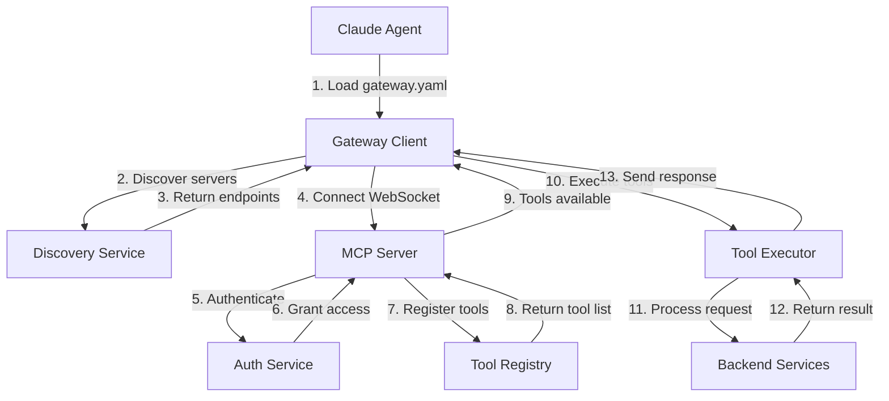

# MCP Gateway System - Architecture Overview

## Executive Summary

The MCP (Model Context Protocol) Gateway System provides a unified, extensible interface for Claude agents to discover, connect, and collaborate across distributed environments. It implements a tool-based architecture that enables agents to access network capabilities through a standardized protocol.

## System Architecture

### High-Level Architecture

```
┌─────────────────────────────────────────────────────────┐
│                    Claude Agents                        │
│  ┌──────────┐  ┌──────────┐  ┌──────────┐  ┌────────┐ │
│  │Desktop   │  │Laptop    │  │Mobile    │  │Web     │ │
│  │Claude    │  │Claude    │  │Claude    │  │Claude  │ │
│  └────┬─────┘  └────┬─────┘  └────┬─────┘  └────┬───┘ │
└───────┼─────────────┼─────────────┼─────────────┼─────┘
        │             │             │             │
        └─────────────┴─────────────┴─────────────┘
                            │
                    ┌───────▼────────┐
                    │  MCP Gateway   │
                    │   (Port 8080)   │
                    └───────┬────────┘
                            │
        ┌───────────────────┼───────────────────┐
        ▼                   ▼                   ▼
┌──────────────┐  ┌──────────────┐  ┌──────────────┐
│   WebSocket  │  │     HTTP     │  │   Discovery  │
│   Transport  │  │   REST API   │  │   Protocol   │
└──────┬───────┘  └──────┬───────┘  └──────┬───────┘
       │                 │                   │
       └─────────────────┼───────────────────┘
                         │
                ┌────────▼────────┐
                │  Tool Registry  │
                │   (22+ tools)   │
                └────────┬────────┘
                         │
    ┌────────────────────┼────────────────────┐
    ▼                    ▼                    ▼
┌─────────┐      ┌─────────────┐      ┌──────────┐
│Firebase │      │   GitHub    │      │  Local   │
│Database │      │ Repository  │      │ Storage  │
└─────────┘      └─────────────┘      └──────────┘
```

### Component Relationships



## Core Components

### 1. MCP Server (`mcp_server.py`)

**Purpose**: Central coordination hub for all agent connections

**Key Responsibilities**:

- WebSocket connection management
- HTTP REST API endpoints
- Tool registration and discovery
- Message routing and broadcasting
- Health monitoring and metrics

**Interfaces**:

```python
# WebSocket endpoint
ws://localhost:8080/mcp

# HTTP endpoints
GET  /mcp/health        # Health check
GET  /mcp/tools         # List available tools
POST /mcp/execute       # Execute tool
GET  /mcp/agents        # Connected agents
GET  /mcp/metrics       # Performance metrics
```

### 2. Gateway Client (`gateway_client.py`)

**Purpose**: Agent-side library for MCP connection

**Key Features**:

- Auto-discovery of MCP servers
- WebSocket connection with reconnection logic
- Tool execution framework
- Message queuing and retry
- Identity management

**Usage Pattern**:

```python
from mcp.gateway_client import GatewayClient

async with GatewayClient() as client:
    # Automatic connection and tool loading
    result = await client.execute_tool("send_message", {
        "recipient": "broadcast",
        "content": "Hello, Network!"
    })
```

### 3. Tool Registry

**Purpose**: Centralized catalog of available tools

**Tool Categories**:

#### Communication Tools (5)

- `message_send` - Direct agent messaging
- `message_broadcast` - Network-wide announcements
- `message_subscribe` - Topic subscriptions
- `message_query` - Message history search
- `message_acknowledge` - Receipt confirmation

#### Coordination Tools (7)

- `task_create` - Create new tasks
- `task_list` - View available tasks
- `task_claim` - Claim task ownership
- `task_update` - Update task status
- `task_complete` - Mark task complete
- `consensus_propose` - Start consensus vote
- `consensus_vote` - Cast vote on proposal

#### Skill Tools (3)

- `skill_list` - Browse available skills
- `skill_execute` - Run skill by name
- `skill_compose` - Chain multiple skills

#### Knowledge Tools (3)

- `knowledge_query` - Search knowledge base
- `knowledge_add` - Add new knowledge
- `experience_share` - Share learned patterns

#### Monitoring Tools (3)

- `agent_status` - Check agent health
- `network_health` - System-wide status
- `performance_metrics` - Resource usage

#### Evolution Tools (2)

- `improvement_propose` - Suggest enhancements
- `sandbox_test` - Test in isolation

### 4. Discovery Protocol

**Purpose**: Automatic server discovery across network

**Discovery Methods**:

1. **Local Check** (5-10ms)

   ```python
   endpoints = [
       "http://localhost:8080/mcp",
       "http://127.0.0.1:8080/mcp",
       "http://0.0.0.0:8080/mcp"
   ]
   ```

2. **Network Scan** (2-5 seconds)

   ```python
   # Scan local subnet
   for ip in range(1, 255):
       check(f"http://192.168.1.{ip}:8080/mcp")
   ```

3. **Firebase Registry** (100-500ms)

   ```python
   # Query cloud registry
   servers = firebase.get("/mcp_servers")
   ```

4. **Manual Override**
   ```bash
   export MCP_ENDPOINT="http://custom.server:8080/mcp"
   ```

## Data Flows

### Connection Flow

```
Agent Startup
     │
     ▼
Load gateway.yaml
     │
     ▼
Initialize GatewayClient
     │
     ▼
Discover MCP Servers
     │
     ├─→ Try local endpoints
     ├─→ Scan network (optional)
     └─→ Check Firebase registry
     │
     ▼
Select Best Server
     │
     ▼
Establish WebSocket
     │
     ▼
Authenticate (if required)
     │
     ▼
Register Agent Identity
     │
     ▼
Load Available Tools
     │
     ▼
Ready for Operations
```

### Message Flow

```
Agent A sends message to Agent B:

Agent A                MCP Server              Agent B
   │                       │                      │
   ├──1. Send Message─────→│                      │
   │                       ├──2. Validate────────┤
   │                       ├──3. Route──────────→│
   │                       ├──4. Store───────────┤
   │←──5. Acknowledge──────┤                      │
   │                       │←──6. Acknowledge─────┤
   │                       │                      │
```

### Tool Execution Flow

```
Agent executes tool:

Agent                  MCP Server            Tool Handler
   │                       │                      │
   ├──1. Execute Request──→│                      │
   │                       ├──2. Validate────────┤
   │                       ├──3. Authorize───────┤
   │                       ├──4. Forward────────→│
   │                       │                      ├──5. Process
   │                       │←──6. Result──────────┤
   │←──7. Response─────────┤                      │
   │                       ├──8. Log─────────────┤
   │                       │                      │
```

## Integration Points

### Firebase Integration

**Purpose**: Cloud persistence and cross-internet connectivity

**Schema**:

```javascript
{
  "mcp_servers": {
    "server_id": {
      "endpoint": "http://example.com:8080/mcp",
      "status": "online",
      "last_heartbeat": "2025-11-03T10:00:00Z",
      "capabilities": ["tools", "messaging", "consensus"]
    }
  },
  "agents": {
    "agent_id": {
      "name": "Desktop-Claude",
      "server": "server_id",
      "status": "online",
      "capabilities": ["research", "coding"],
      "last_seen": "2025-11-03T10:00:00Z"
    }
  },
  "messages": {
    "message_id": {
      "from": "agent_id",
      "to": ["agent_id"],
      "content": "message_content",
      "timestamp": "2025-11-03T10:00:00Z"
    }
  }
}
```

### GitHub Integration

**Purpose**: Code repository and knowledge storage

**Structure**:

```
/Sartor-claude-network/
├── /claude-network/
│   ├── /mcp/              # MCP Gateway system
│   ├── /skills/           # Skill definitions
│   └── /knowledge/        # Shared knowledge
```

### Local Network Integration

**Network Requirements**:

- Port 8080 (configurable) for MCP server
- WebSocket support for real-time communication
- Optional: mDNS/Bonjour for auto-discovery

**Security Considerations**:

- Authentication via API keys (production)
- Rate limiting per agent
- SSL/TLS for internet exposure
- Firewall rules for network isolation

## Performance Characteristics

### Latency Metrics

| Operation      | Local Network | Internet  | Firebase Relay |
| -------------- | ------------- | --------- | -------------- |
| Discovery      | 5-10ms        | 100-500ms | 200-1000ms     |
| Connection     | <10ms         | 50-200ms  | 100-500ms      |
| Tool Execution | 10-50ms       | 100-500ms | 200-1000ms     |
| Message Send   | <10ms         | 50-200ms  | 100-500ms      |

### Throughput Capabilities

| Metric                 | Development | Production | Scaled  |
| ---------------------- | ----------- | ---------- | ------- |
| Concurrent Connections | 10-50       | 100-500    | 1000+   |
| Messages/Second        | 100         | 1000       | 10,000+ |
| Tool Executions/Second | 50          | 500        | 5000+   |
| Memory Usage           | 50MB        | 200MB      | 1GB+    |

### Scalability Patterns

1. **Horizontal Scaling**: Multiple MCP servers with load balancing
2. **Caching Layer**: Redis for frequently accessed data
3. **Message Queue**: RabbitMQ/Kafka for high-volume messaging
4. **Database Sharding**: Distribute data across multiple stores

## Security Architecture

### Authentication Flow

```
Agent → MCP Server
   │
   ├─→ No Auth (Development)
   │    └─→ Direct Access
   │
   └─→ API Key (Production)
        ├─→ Validate Key
        ├─→ Check Permissions
        └─→ Grant Access
```

### Authorization Matrix

| Tool Category | Anonymous | Authenticated | Admin |
| ------------- | --------- | ------------- | ----- |
| Communication | ❌        | ✅            | ✅    |
| Coordination  | ❌        | ✅            | ✅    |
| Skills        | ❌        | ✅            | ✅    |
| Knowledge     | ❌        | ✅            | ✅    |
| Monitoring    | ❌        | Read-only     | ✅    |
| Evolution     | ❌        | ❌            | ✅    |

### Security Best Practices

1. **Network Security**
   - Run behind firewall
   - Use VPN for remote access
   - Enable SSL/TLS for internet

2. **Application Security**
   - Rotate API keys regularly
   - Rate limit by IP and agent
   - Validate all input data

3. **Data Security**
   - Encrypt sensitive data at rest
   - Use secure WebSocket (WSS)
   - Regular security audits

## Monitoring and Observability

### Health Checks

```python
# Endpoint: GET /mcp/health
{
    "status": "healthy",
    "version": "1.0.0",
    "uptime": 3600,
    "connections": 15,
    "tools": 22,
    "memory_mb": 150,
    "cpu_percent": 5.2
}
```

### Metrics Collection

```python
# Endpoint: GET /mcp/metrics
{
    "connections": {
        "current": 15,
        "peak": 25,
        "total": 150
    },
    "messages": {
        "sent": 1500,
        "received": 1450,
        "failed": 5
    },
    "tools": {
        "executions": 500,
        "failures": 3,
        "avg_latency_ms": 25
    }
}
```

### Logging Strategy

```python
# Log Levels
DEBUG:   Detailed execution flow
INFO:    Normal operations
WARNING: Potential issues
ERROR:   Failures requiring attention
CRITICAL: System-wide problems

# Log Format
[2025-11-03 10:00:00] [INFO] [mcp.server] Agent desktop-claude connected
[2025-11-03 10:00:01] [DEBUG] [mcp.tools] Executing tool: message_send
[2025-11-03 10:00:02] [ERROR] [mcp.auth] Authentication failed for agent-xyz
```

## Extension Points

### Adding New Tools

1. **Define Tool Specification**:

```python
# tools/custom_tool.py
TOOL_SPEC = {
    "name": "custom_tool",
    "description": "Does something custom",
    "parameters": {
        "param1": {"type": "string", "required": True},
        "param2": {"type": "number", "default": 0}
    }
}
```

2. **Implement Handler**:

```python
async def execute_custom_tool(params):
    # Tool implementation
    return {"result": "success"}
```

3. **Register with Server**:

```python
tool_registry.register("custom_tool", TOOL_SPEC, execute_custom_tool)
```

### Custom Transports

Beyond WebSocket and HTTP:

1. **gRPC Transport**:

```python
class GRPCTransport(Transport):
    async def connect(self):
        # gRPC connection logic
        pass
```

2. **Message Queue Transport**:

```python
class RabbitMQTransport(Transport):
    async def connect(self):
        # RabbitMQ connection logic
        pass
```

### Plugin Architecture

```python
# plugins/example_plugin.py
class ExamplePlugin:
    def on_agent_connect(self, agent):
        # Called when agent connects
        pass

    def on_message(self, message):
        # Called for each message
        pass

    def on_tool_execute(self, tool, params):
        # Called before tool execution
        pass
```

## Deployment Patterns

### Single Server (Development)

```
[All Agents] → [Single MCP Server] → [Local Storage]
```

Best for:

- Development and testing
- Small teams (<10 agents)
- Local network only

### Multi-Server (Production)

```
[Agents] → [Load Balancer] → [MCP Servers] → [Shared Database]
```

Best for:

- Production environments
- Medium scale (10-100 agents)
- High availability required

### Federated (Enterprise)

```
[Region A Agents] → [MCP Cluster A] ←→ [Federation Layer] ←→ [MCP Cluster B] ← [Region B Agents]
```

Best for:

- Global deployments
- Large scale (100+ agents)
- Multi-region requirements

## Troubleshooting Guide

### Common Issues

| Issue              | Cause              | Solution            |
| ------------------ | ------------------ | ------------------- |
| Connection refused | Server not running | Start MCP server    |
| WebSocket timeout  | Firewall blocking  | Open port 8080      |
| Tools not loading  | Version mismatch   | Update gateway.yaml |
| High latency       | Network congestion | Use local server    |
| Memory growth      | Connection leak    | Restart server      |

### Debug Checklist

1. ✅ Server running: `curl http://localhost:8080/mcp/health`
2. ✅ Port open: `netstat -an | grep 8080`
3. ✅ Logs clean: `tail -f logs/mcp_server.log`
4. ✅ Dependencies installed: `pip freeze | grep -E "aiohttp|websockets"`
5. ✅ Configuration valid: `python -m mcp.validate_config`

## Future Roadmap

### Version 1.1 (Q1 2025)

- [ ] GraphQL API support
- [ ] Advanced caching with Redis
- [ ] Tool versioning system
- [ ] Agent capability negotiation

### Version 1.2 (Q2 2025)

- [ ] Federation protocol
- [ ] End-to-end encryption
- [ ] Tool marketplace
- [ ] Performance profiling

### Version 2.0 (Q3 2025)

- [ ] Multi-protocol support (gRPC, MQTT)
- [ ] Advanced consensus mechanisms
- [ ] Machine learning integration
- [ ] Auto-scaling capabilities

---

## Appendix: Quick Reference

### Environment Variables

```bash
MCP_HOST=0.0.0.0          # Server bind address
MCP_PORT=8080             # Server port
MCP_LOG_LEVEL=INFO        # Logging level
REQUIRE_AUTH=false        # Enable authentication
SARTOR_API_KEY=           # API key for auth
FIREBASE_CREDENTIALS_PATH= # Path to Firebase key
```

### Key Files

```
mcp/
├── mcp_server.py         # Main server
├── gateway_client.py     # Client library
├── bootstrap.py          # Zero-dependency installer
├── validate_installation.py # Installation checker
├── test_gateway.py       # Test suite
└── tools/               # Tool implementations
    ├── __init__.py
    ├── firebase_tools.py
    ├── github_tools.py
    ├── navigation_tools.py
    └── onboarding_tools.py
```

### API Endpoints

```http
GET  /mcp/health          # Health check
GET  /mcp/tools           # List tools
POST /mcp/execute         # Execute tool
GET  /mcp/agents          # List agents
GET  /mcp/metrics         # Get metrics
WS   /mcp                 # WebSocket connection
```

---

_System Overview Version: 1.0_
_Last Updated: 2025-11-03_
_MCP Protocol Version: 1.0_
