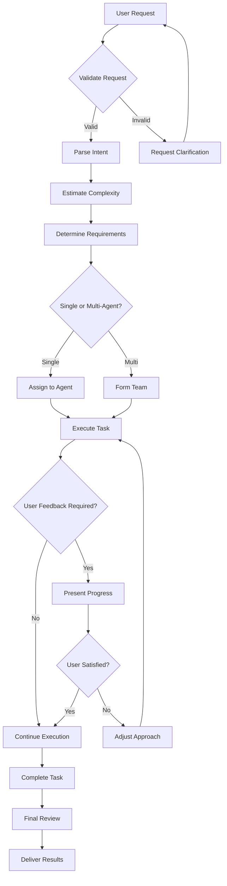
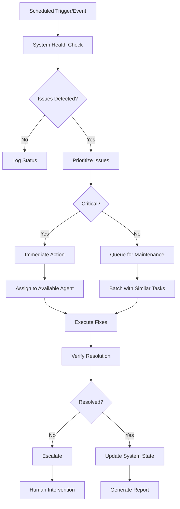
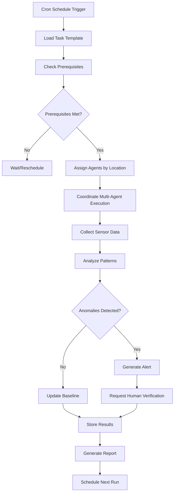
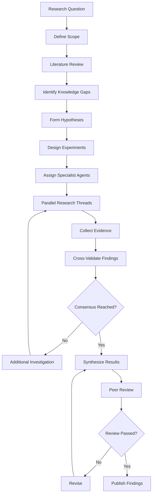
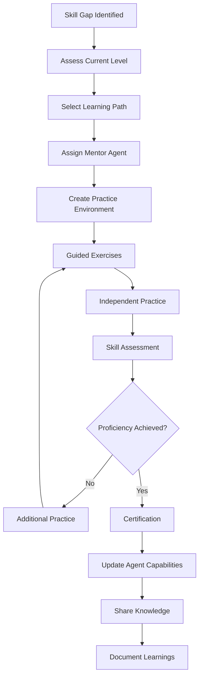

# Detailed Task Workflow Specifications

## 1. User-Initiated Task Workflow

### Workflow Definition
User requests are the primary driver of the agent community, requiring careful handling to ensure satisfaction.

### Process Flow


### Key Components

#### Request Validation
```python
validation_rules = {
    "has_clear_objective": True,
    "within_capabilities": True,
    "ethical_compliance": True,
    "resource_availability": True,
    "reasonable_scope": True
}
```

#### Complexity Estimation
- **Simple** (<30 min): Single file edit, quick answer
- **Moderate** (30 min - 2 hrs): Multi-file changes, research needed
- **Complex** (2+ hrs): System design, extensive implementation

#### User Interaction Points
1. **Initial Clarification**: Missing requirements
2. **Progress Updates**: Milestones reached
3. **Decision Points**: Multiple valid approaches
4. **Review Feedback**: Output validation
5. **Completion Confirmation**: Task closure

### Example Task Flow
```yaml
task:
  type: user_request
  request: "Build a web scraper for news articles"

flow:
  - validate: Check if web scraping is allowed
  - parse: Identify target sites, data needed
  - estimate: Complex task (3-4 hours)
  - requirements:
    - Web scraping library
    - HTML parsing
    - Data storage
    - Error handling
  - team:
    - Research Agent: Find best practices
    - Implementation Agent: Build scraper
    - Testing Agent: Validate output
  - execution:
    - Research phase (30 min)
    - Design phase (30 min)
    - Implementation (2 hrs)
    - Testing (1 hr)
  - review: Code review, test results
  - delivery: Working scraper with documentation
```

## 2. System Maintenance Workflow

### Workflow Definition
Automated tasks that keep the agent ecosystem healthy and optimized.

### Process Flow


### Maintenance Categories

#### Performance Optimization
```yaml
trigger: CPU usage > 80% for 5 minutes
actions:
  - Identify resource-heavy processes
  - Optimize database queries
  - Clear unnecessary caches
  - Rebalance agent workloads
verification:
  - CPU usage < 60%
  - Response time < 100ms
```

#### Data Cleanup
```yaml
trigger: Daily at 2 AM
actions:
  - Archive completed tasks > 30 days old
  - Compress log files
  - Remove temporary artifacts
  - Vacuum databases
verification:
  - Storage usage < 70%
  - No orphaned records
```

#### Security Patching
```yaml
trigger: Security advisory received
actions:
  - Assess vulnerability impact
  - Test patch in staging
  - Rolling update to production
  - Verify no breaking changes
verification:
  - All agents on latest version
  - Security scan passes
```

### Example Maintenance Task
```json
{
  "type": "maintenance",
  "subtype": "memory_optimization",
  "trigger": "memory_usage_alert",
  "priority": "high",
  "auto_assigned": true,
  "steps": [
    "Identify memory leaks",
    "Restart affected services",
    "Clear caches",
    "Optimize data structures",
    "Monitor for 30 minutes"
  ],
  "success_criteria": {
    "memory_usage": "< 70%",
    "no_errors": true,
    "performance_maintained": true
  }
}
```

## 3. Scheduled Task Workflow (House Management)

### Workflow Definition
Recurring tasks for physical environment monitoring and management.

### Process Flow


### House Management Tasks

#### Environmental Monitoring
```yaml
schedule: "*/15 * * * *"  # Every 15 minutes
agents:
  - Desktop: Central coordination
  - iPad: Mobile sensing
  - IoT Agents: Fixed sensors
tasks:
  - Check temperature/humidity
  - Monitor energy usage
  - Detect motion patterns
  - Verify security status
outputs:
  - Real-time dashboard
  - Anomaly alerts
  - Daily summary report
```

#### Learning Environment Check
```yaml
schedule: "0 9,15,20 * * *"  # 9 AM, 3 PM, 8 PM
agents:
  - Desktop: Analysis and recommendations
tasks:
  - Assess workspace organization
  - Check lighting conditions
  - Monitor noise levels
  - Suggest improvements
outputs:
  - Comfort score
  - Productivity recommendations
  - Environmental adjustments
```

### Example House Task
```json
{
  "type": "scheduled",
  "subtype": "room_exploration",
  "schedule": "0 10 * * SAT",
  "description": "Weekly room-by-room check",
  "agents": {
    "coordinator": "desktop",
    "explorer": "ipad",
    "analyst": "ml_agent"
  },
  "workflow": [
    {
      "step": "plan_route",
      "agent": "coordinator",
      "output": "exploration_path"
    },
    {
      "step": "capture_images",
      "agent": "explorer",
      "output": "room_photos"
    },
    {
      "step": "analyze_changes",
      "agent": "analyst",
      "output": "change_report"
    },
    {
      "step": "update_house_map",
      "agent": "coordinator",
      "output": "updated_map"
    }
  ]
}
```

## 4. Research Task Workflow

### Workflow Definition
Complex investigative tasks requiring systematic exploration and validation.

### Process Flow


### Research Methodology

#### Literature Review Protocol
```python
literature_review = {
    "sources": ["academic_papers", "technical_docs", "code_repos"],
    "search_strategy": "systematic",
    "inclusion_criteria": {
        "relevance": "> 0.7",
        "recency": "< 5 years",
        "quality": "peer_reviewed OR highly_cited"
    },
    "extraction": {
        "key_concepts": True,
        "methodologies": True,
        "results": True,
        "limitations": True
    }
}
```

#### Evidence Validation Framework
Following CLAUDE.md anti-fabrication protocols:
- No fabricated metrics or scores
- Evidence-based conclusions only
- Clear limitation statements
- External validation required for claims

### Example Research Task
```yaml
task:
  type: research
  question: "Optimal agent coordination strategies for distributed systems"

phases:
  literature_review:
    duration: 2 hours
    agents: [research_agent_1, research_agent_2]
    outputs:
      - Annotated bibliography
      - Concept map
      - Gap analysis

  hypothesis_formation:
    duration: 1 hour
    agents: [senior_researcher]
    outputs:
      - Research hypotheses
      - Test criteria
      - Success metrics

  experimentation:
    duration: 4 hours
    agents: [experiment_agent_1, experiment_agent_2, experiment_agent_3]
    outputs:
      - Test results
      - Performance data
      - Failure analysis

  synthesis:
    duration: 2 hours
    agents: [analyst_agent]
    outputs:
      - Research report
      - Recommendations
      - Future work
```

## 5. Learning Task Workflow

### Workflow Definition
Skill development and knowledge acquisition tasks for agent improvement.

### Process Flow


### Learning Frameworks

#### Skill Progression Levels
```yaml
levels:
  beginner:
    - Understand concepts
    - Follow tutorials
    - Complete guided tasks

  intermediate:
    - Apply knowledge independently
    - Handle edge cases
    - Debug issues

  advanced:
    - Design solutions
    - Optimize performance
    - Teach others

  expert:
    - Innovate approaches
    - Handle complex scenarios
    - Lead research
```

#### Practice Methodologies
```python
practice_methods = {
    "scaffolded_learning": {
        "start": "simple_examples",
        "progression": "gradual_complexity",
        "support": "decreasing_over_time"
    },
    "deliberate_practice": {
        "focus": "specific_skills",
        "feedback": "immediate",
        "repetition": "until_mastery"
    },
    "peer_learning": {
        "method": "pair_programming",
        "review": "code_review",
        "discussion": "knowledge_sharing"
    }
}
```

### Example Learning Task
```json
{
  "type": "learning",
  "skill": "distributed_consensus_algorithms",
  "learner": "junior_agent_3",
  "mentor": "senior_agent_1",
  "curriculum": [
    {
      "module": "Basic Concepts",
      "duration": "2 hours",
      "activities": [
        "Read Raft paper",
        "Watch visualization",
        "Answer quiz"
      ]
    },
    {
      "module": "Implementation",
      "duration": "4 hours",
      "activities": [
        "Code simple leader election",
        "Handle network partitions",
        "Test edge cases"
      ]
    },
    {
      "module": "Optimization",
      "duration": "3 hours",
      "activities": [
        "Performance profiling",
        "Implement improvements",
        "Benchmark results"
      ]
    }
  ],
  "assessment": {
    "type": "practical_project",
    "requirement": "Build working consensus system",
    "success_criteria": {
      "correctness": "All tests pass",
      "performance": "< 100ms latency",
      "resilience": "Handles 2 node failures"
    }
  }
}
```

## Workflow Integration Points

### Cross-Workflow Dependencies
```yaml
dependencies:
  user_request:
    may_trigger: [research, learning]
    blocked_by: [maintenance]

  maintenance:
    priority: highest
    blocks: [user_request, scheduled]

  scheduled:
    may_spawn: [maintenance]
    deferred_by: [user_request]

  research:
    may_require: [learning]
    outputs_to: [user_request]

  learning:
    enables: [research, user_request]
    triggered_by: [skill_gap]
```

### Workflow Orchestration
```python
class WorkflowOrchestrator:
    def process_task(self, task):
        workflow = self.select_workflow(task.type)

        # Check dependencies
        if not self.dependencies_met(task):
            return self.queue_with_dependencies(task)

        # Check priorities
        if self.higher_priority_exists(task):
            return self.defer_task(task)

        # Execute workflow
        return workflow.execute(task)

    def handle_workflow_transition(self, task, from_workflow, to_workflow):
        # Preserve context
        context = from_workflow.export_context(task)
        to_workflow.import_context(task, context)

        # Transfer artifacts
        artifacts = from_workflow.get_artifacts(task)
        to_workflow.add_artifacts(task, artifacts)

        # Continue execution
        return to_workflow.continue_execution(task)
```

## Performance Metrics by Workflow

### User Request Metrics
- Time to first response
- User satisfaction score
- Iteration count before satisfaction
- Task completion time

### Maintenance Metrics
- Issues prevented vs reacted
- System availability improvement
- Resource optimization percentage
- Maintenance overhead time

### Scheduled Task Metrics
- On-time execution rate
- Coverage completeness
- Pattern detection accuracy
- Report generation time

### Research Metrics
- Knowledge gaps identified
- Hypotheses validated ratio
- Evidence quality score
- Time to insight

### Learning Metrics
- Skill acquisition rate
- Retention after 30 days
- Application success rate
- Knowledge transfer effectiveness

---

*These detailed workflows ensure consistent, efficient task processing across all types while maintaining quality and meeting user expectations.*