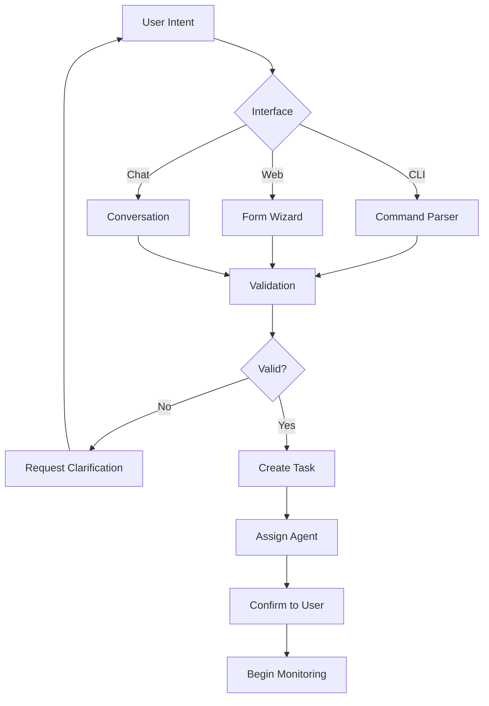
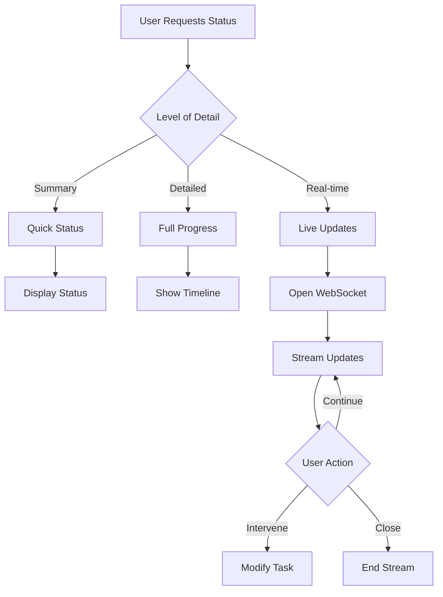

# User Interaction Model & Interface Design

## Overview
A multi-modal interaction system enabling users to create, monitor, and manage tasks through various interfaces while maintaining a consistent and intuitive experience.

## 1. User Personas & Use Cases

### Primary User Personas

#### Alton (Father/Administrator)
```yaml
profile:
  technical_level: Advanced
  primary_goals:
    - System oversight
    - Educational guidance
    - Complex task management
  preferred_interfaces:
    - Command line
    - Web dashboard
    - Direct API access
  interaction_patterns:
    - Batch operations
    - System configuration
    - Performance monitoring
```

#### Vayu (Son/Learner)
```yaml
profile:
  technical_level: Beginner to Intermediate
  primary_goals:
    - Learning programming
    - Game development
    - Fun exploration
  preferred_interfaces:
    - Visual interfaces
    - Voice commands
    - Simplified CLI
  interaction_patterns:
    - Step-by-step guidance
    - Visual feedback
    - Interactive learning
```

#### General Users
```yaml
profile:
  technical_level: Varied
  primary_goals:
    - Task completion
    - Status monitoring
    - Result retrieval
  preferred_interfaces:
    - Web portal
    - Mobile app
    - Chat interface
  interaction_patterns:
    - Natural language
    - Quick actions
    - Notifications
```

## 2. Interaction Channels

### Command Line Interface (CLI)

#### Basic Commands
```bash
# Task Management
vayu task create "Build a weather app"
vayu task create --type research --priority high "Analyze Python best practices"
vayu task status 12345
vayu task list --status active
vayu task cancel 12345

# Agent Management
vayu agent list
vayu agent status desktop
vayu agent assign 12345 --to desktop
vayu agent workload

# System Commands
vayu system status
vayu system health
vayu system config --show
```

#### Advanced CLI Features
```bash
# Batch Operations
vayu task create --from tasks.yaml
vayu task update --where "status=queued" --set "priority=high"

# Monitoring
vayu monitor --follow
vayu monitor --filter "type=error"

# Reports
vayu report daily
vayu report custom --from "2025-11-01" --to "2025-11-03"

# Interactive Mode
vayu interactive
> task create
  Type: [user_request]
  Description: Build a calculator
  Priority: [normal]
  Task created: 12346
```

#### CLI Configuration
```yaml
# ~/.vayu/config.yaml
defaults:
  priority: normal
  type: user_request
  assignee: auto

aliases:
  tc: task create
  ts: task status
  tl: task list

formatting:
  color: true
  timestamps: relative
  output: table

notifications:
  on_complete: true
  on_error: true
```

### Web Dashboard Interface

#### Dashboard Components
```html
<!-- Main Navigation -->
<nav class="main-nav">
  <div class="logo">Vayu Agent Network</div>
  <menu>
    <item>Dashboard</item>
    <item>Tasks</item>
    <item>Agents</item>
    <item>Reports</item>
    <item>Settings</item>
  </menu>
  <user-menu>
    <profile />
    <notifications />
    <logout />
  </user-menu>
</nav>

<!-- Quick Actions Bar -->
<action-bar>
  <button onclick="quickCreateTask()">New Task</button>
  <button onclick="viewActiveAasks()">Active Tasks</button>
  <button onclick="generateReport()">Generate Report</button>
  <search placeholder="Search tasks..." />
</action-bar>

<!-- Task Creation Wizard -->
<task-wizard>
  <step name="type">
    <radio-group>
      <option>User Request</option>
      <option>Research</option>
      <option>Maintenance</option>
      <option>Learning</option>
    </radio-group>
  </step>

  <step name="details">
    <input type="text" placeholder="Title" />
    <textarea placeholder="Description" />
    <select name="priority">
      <option>Low</option>
      <option>Normal</option>
      <option>High</option>
      <option>Critical</option>
    </select>
  </step>

  <step name="assignment">
    <radio>
      <option>Auto-assign</option>
      <option>Select agents</option>
    </radio>
    <agent-selector multiple />
  </step>

  <step name="review">
    <summary />
    <button>Create Task</button>
  </step>
</task-wizard>
```

#### Real-Time Updates
```javascript
// WebSocket connection for real-time updates
class DashboardConnection {
  constructor() {
    this.ws = new WebSocket('ws://localhost:8080/dashboard');
    this.subscriptions = new Map();
  }

  subscribe(eventType, callback) {
    this.subscriptions.set(eventType, callback);
    this.ws.send(JSON.stringify({
      action: 'subscribe',
      events: [eventType]
    }));
  }

  handleMessage(event) {
    const data = JSON.parse(event.data);
    const callback = this.subscriptions.get(data.type);
    if (callback) {
      callback(data.payload);
    }
  }
}

// Usage
const connection = new DashboardConnection();
connection.subscribe('task_status_change', (data) => {
  updateTaskCard(data.task_id, data.new_status);
});
```

### Natural Language Interface

#### Conversation Patterns
```yaml
task_creation:
  user: "I need help building a Python web scraper"
  system: "I'll create a task for building a Python web scraper. What website do you want to scrape?"
  user: "News articles from CNN"
  system: "Got it. What priority should this have?"
  user: "High priority please"
  system: "Task created: Build Python web scraper for CNN news articles (High priority). Assigned to Research Agent. Estimated time: 2 hours."

status_check:
  user: "What's the status of my web scraper task?"
  system: "Your web scraper task is currently in progress (65% complete). The Research Agent has completed the initial design and is now implementing the scraping logic. Estimated completion in 45 minutes."

multi_task:
  user: "Can you help me with three things: fix the login bug, update the documentation, and run the test suite?"
  system: "I'll create three tasks for you:
    1. Fix login bug (High priority) - Assigned to Debug Agent
    2. Update documentation (Normal priority) - Assigned to Documentation Agent
    3. Run test suite (Normal priority) - Assigned to Testing Agent
    All tasks have been queued. Would you like to track their progress?"
```

#### Intent Recognition
```python
class IntentRecognizer:
    intents = {
        "create_task": ["create", "build", "make", "need", "help with"],
        "check_status": ["status", "progress", "how is", "what's happening"],
        "list_tasks": ["show", "list", "what tasks", "my tasks"],
        "cancel_task": ["cancel", "stop", "abort", "don't need"],
        "modify_task": ["change", "update", "modify", "edit"],
        "get_help": ["help", "how do I", "what can you do"]
    }

    def recognize_intent(self, user_input):
        user_input_lower = user_input.lower()

        for intent, keywords in self.intents.items():
            if any(keyword in user_input_lower for keyword in keywords):
                return {
                    "intent": intent,
                    "confidence": self.calculate_confidence(user_input, keywords),
                    "entities": self.extract_entities(user_input, intent)
                }

        return {"intent": "unknown", "confidence": 0}
```

### Voice Interface (Future)
```yaml
voice_commands:
  activation: "Hey Vayu"

  commands:
    - "Create a new task"
    - "What's my task status?"
    - "Show me active agents"
    - "Cancel current task"
    - "Generate daily report"

  feedback:
    audio: true
    visual: true
    haptic: mobile_only

  accessibility:
    speech_to_text: true
    text_to_speech: true
    voice_profiles: multiple
```

## 3. User Interaction Flows

### Task Creation Flow


### Task Monitoring Flow


## 4. Notification System

### Notification Channels
```yaml
channels:
  in_app:
    - Toast notifications
    - Badge counts
    - Alert banners
    - Status indicators

  email:
    - Task completion
    - Error alerts
    - Daily summaries
    - Weekly reports

  push:
    - Mobile notifications
    - Desktop notifications
    - Browser notifications

  integrations:
    - Slack messages
    - Discord webhooks
    - SMS (critical only)
```

### Notification Preferences
```json
{
  "user_preferences": {
    "notification_levels": {
      "task_created": "in_app",
      "task_assigned": "email",
      "task_completed": "all",
      "task_failed": "all",
      "system_alert": "push"
    },
    "quiet_hours": {
      "enabled": true,
      "start": "22:00",
      "end": "08:00",
      "exceptions": ["critical"]
    },
    "batching": {
      "enabled": true,
      "frequency": "hourly",
      "types": ["low", "medium"]
    }
  }
}
```

## 5. Access Control & Permissions

### Role-Based Access Control
```yaml
roles:
  admin:
    permissions:
      - create_any_task
      - modify_any_task
      - delete_any_task
      - manage_agents
      - view_all_reports
      - configure_system

  user:
    permissions:
      - create_own_tasks
      - modify_own_tasks
      - view_own_tasks
      - view_public_agents
      - generate_own_reports

  viewer:
    permissions:
      - view_public_tasks
      - view_system_status
      - view_public_reports

  developer:
    permissions:
      - create_any_task
      - modify_any_task
      - view_all_tasks
      - debug_access
      - api_full_access
```

### Authentication Methods
```python
class AuthenticationManager:
    methods = {
        "password": self.authenticate_password,
        "oauth": self.authenticate_oauth,
        "api_key": self.authenticate_api_key,
        "biometric": self.authenticate_biometric
    }

    def authenticate(self, method, credentials):
        if method not in self.methods:
            raise ValueError(f"Unknown authentication method: {method}")

        user = self.methods[method](credentials)

        if user:
            session = self.create_session(user)
            return {
                "success": True,
                "user": user,
                "session": session,
                "permissions": self.get_permissions(user)
            }

        return {"success": False, "error": "Authentication failed"}
```

## 6. Feedback Mechanisms

### User Feedback Collection
```yaml
feedback_points:
  task_completion:
    prompt: "How satisfied are you with the result?"
    options: [1-5 stars]
    optional_comment: true

  task_failure:
    prompt: "What went wrong?"
    options: [
      "Incorrect result",
      "Too slow",
      "Incomplete",
      "Other"
    ]
    required_comment: true

  agent_interaction:
    prompt: "How was your experience?"
    metrics:
      - Helpfulness
      - Clarity
      - Speed
      - Accuracy

  system_usability:
    prompt: "Rate the interface"
    metrics:
      - Ease of use
      - Performance
      - Features
      - Design
```

### Feedback Processing
```python
class FeedbackProcessor:
    def process_feedback(self, feedback):
        # Store feedback
        self.store_feedback(feedback)

        # Analyze sentiment
        sentiment = self.analyze_sentiment(feedback.comment)

        # Update metrics
        self.update_metrics({
            "task_id": feedback.task_id,
            "rating": feedback.rating,
            "sentiment": sentiment
        })

        # Trigger actions
        if feedback.rating < 3:
            self.trigger_improvement_workflow(feedback)

        # Learn from feedback
        self.update_learning_model(feedback)

        return {
            "processed": True,
            "actions_taken": self.get_actions_taken(feedback)
        }
```

## 7. Help & Documentation

### In-App Help System
```yaml
help_system:
  contextual_help:
    - Tooltips on hover
    - Info icons with explanations
    - Inline documentation
    - Smart suggestions

  guided_tours:
    - First-time user onboarding
    - Feature introductions
    - Task creation walkthrough
    - Dashboard orientation

  search:
    - Full-text search
    - Command palette
    - Quick answers
    - Related topics

  support:
    - FAQ section
    - Video tutorials
    - Community forum
    - Direct support chat
```

### Interactive Tutorial System
```javascript
class TutorialSystem {
  tutorials = {
    'first_task': {
      steps: [
        {
          element: '#create-task-button',
          message: 'Click here to create your first task',
          position: 'bottom'
        },
        {
          element: '#task-type-selector',
          message: 'Select the type of task you want to create',
          position: 'right'
        },
        {
          element: '#task-description',
          message: 'Describe what you want to accomplish',
          position: 'top'
        }
      ]
    }
  };

  startTutorial(name) {
    const tutorial = this.tutorials[name];
    this.currentStep = 0;
    this.showStep(tutorial.steps[0]);
  }
}
```

## 8. Personalization

### User Preferences
```json
{
  "personalization": {
    "interface": {
      "theme": "dark",
      "language": "en",
      "timezone": "America/New_York",
      "date_format": "MM/DD/YYYY",
      "compact_view": false
    },
    "defaults": {
      "task_priority": "normal",
      "task_assignment": "auto",
      "notification_channel": "email"
    },
    "shortcuts": {
      "ctrl+n": "new_task",
      "ctrl+s": "search",
      "ctrl+r": "refresh"
    },
    "dashboard": {
      "widgets": ["active_tasks", "agent_status", "recent_activity"],
      "layout": "three_column",
      "refresh_rate": 5
    }
  }
}
```

### Adaptive Interface
```python
class AdaptiveInterface:
    def adapt_to_user(self, user_id):
        # Learn from usage patterns
        patterns = self.analyze_usage_patterns(user_id)

        # Adjust interface
        adjustments = {
            "frequently_used_features": self.promote_features(patterns.frequent),
            "suggested_shortcuts": self.suggest_shortcuts(patterns.workflows),
            "optimized_layout": self.optimize_layout(patterns.navigation),
            "predictive_actions": self.predict_next_action(patterns.sequences)
        }

        return adjustments

    def predict_next_action(self, user_context):
        # Based on time of day
        if self.is_morning():
            return ["view_daily_summary", "check_overnight_tasks"]

        # Based on recent actions
        if user_context.last_action == "create_task":
            return ["monitor_task", "create_similar_task"]

        # Based on patterns
        return self.ml_predict_action(user_context)
```

## 9. Mobile Responsiveness

### Responsive Design
```css
/* Mobile-first approach */
.task-card {
  width: 100%;
  padding: 1rem;
}

/* Tablet */
@media (min-width: 768px) {
  .task-card {
    width: 50%;
  }
}

/* Desktop */
@media (min-width: 1024px) {
  .task-card {
    width: 33.33%;
  }
}

/* Touch-optimized controls */
.touch-target {
  min-height: 44px;
  min-width: 44px;
}

/* Gesture support */
.swipeable {
  touch-action: pan-y;
}
```

### Mobile-Specific Features
```yaml
mobile_features:
  gestures:
    - Swipe to dismiss
    - Pull to refresh
    - Long press for options
    - Pinch to zoom

  offline_mode:
    - Cache recent tasks
    - Queue actions
    - Sync when online
    - Local notifications

  optimizations:
    - Reduced data usage
    - Battery optimization
    - Simplified UI
    - Voice input priority
```

## 10. Accessibility

### Accessibility Standards
```yaml
wcag_compliance:
  level: AA

  visual:
    - High contrast mode
    - Adjustable font sizes
    - Color blind friendly
    - Screen reader support

  motor:
    - Keyboard navigation
    - Large touch targets
    - Gesture alternatives
    - Voice control

  cognitive:
    - Clear language
    - Consistent navigation
    - Progress indicators
    - Error recovery

  auditory:
    - Visual alerts
    - Captions for videos
    - Text alternatives
```

### Accessibility Implementation
```javascript
class AccessibilityManager {
  enableScreenReader() {
    // Add ARIA labels
    document.querySelectorAll('[data-label]').forEach(el => {
      el.setAttribute('aria-label', el.dataset.label);
    });

    // Add role attributes
    document.querySelectorAll('[data-role]').forEach(el => {
      el.setAttribute('role', el.dataset.role);
    });

    // Enable keyboard navigation
    this.enableKeyboardNav();

    // Announce changes
    this.enableLiveRegions();
  }

  enableKeyboardNav() {
    document.addEventListener('keydown', (e) => {
      switch(e.key) {
        case 'Tab':
          this.handleTabNavigation(e);
          break;
        case 'Enter':
          this.handleEnterKey(e);
          break;
        case 'Escape':
          this.handleEscapeKey(e);
          break;
      }
    });
  }
}
```

---

*This user interaction model ensures intuitive, accessible, and efficient task management across all user types and interaction preferences while maintaining consistency and supporting both simple and complex workflows.*