# Memory System Architecture Diagrams

## System Overview

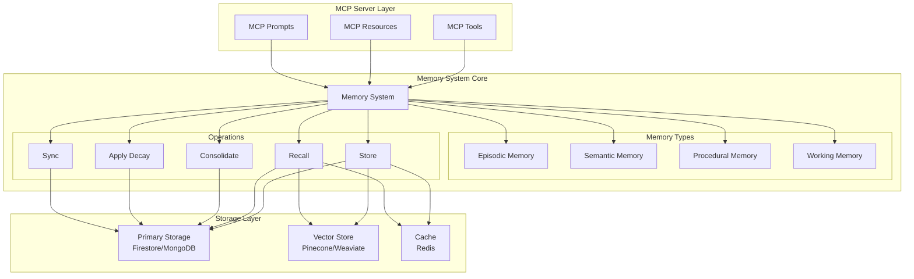

## Memory Type Relationships

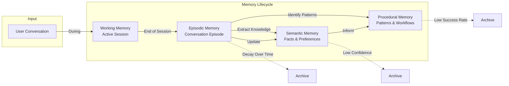

## Memory State Lifecycle

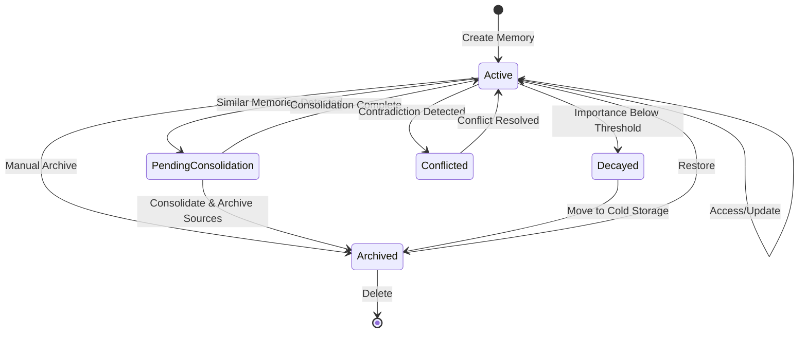

## Episodic Memory Structure

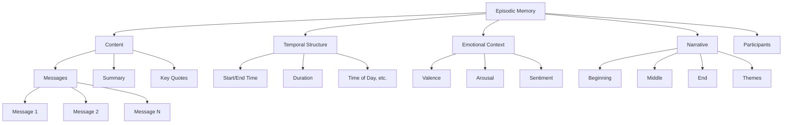

## Semantic Memory Structure

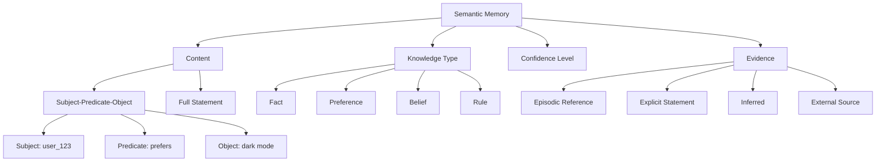

## Procedural Memory Structure

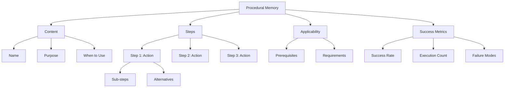

## Memory Recall Flow

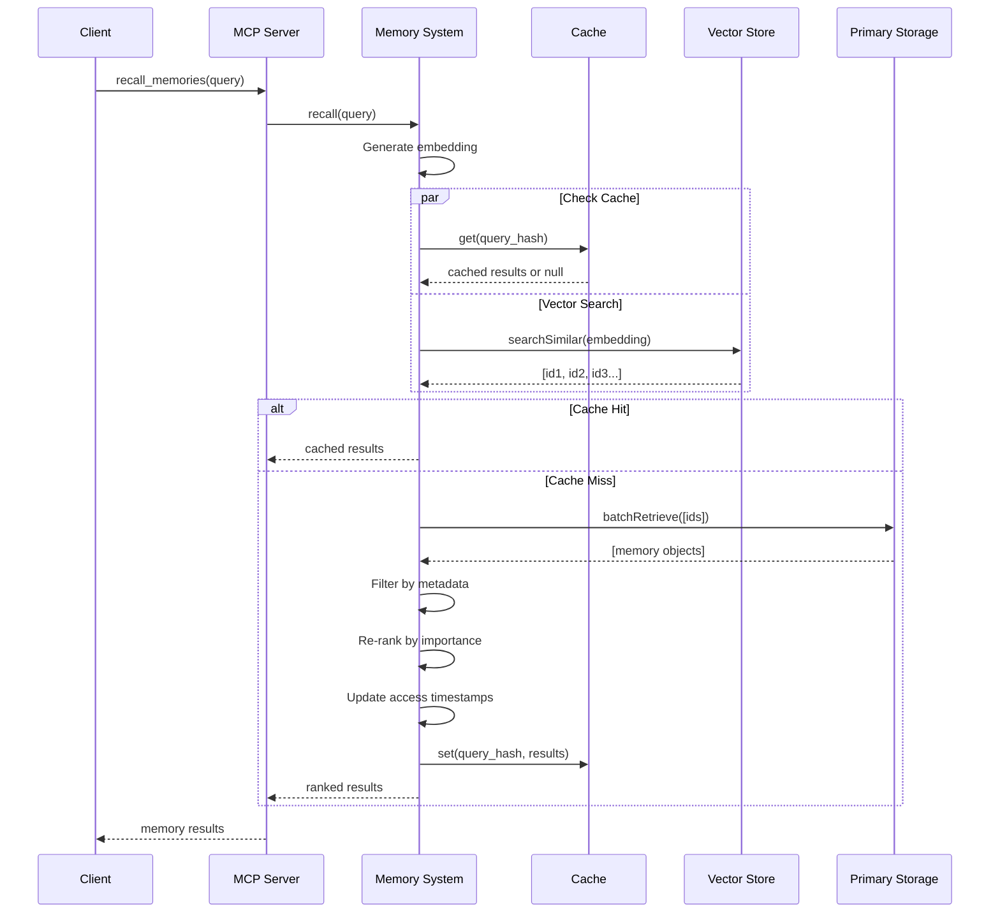

## Importance Decay Flow

```mermaid
flowchart TD
    Start([Start Decay Process]) --> GetAll[Get All Active Memories]

    GetAll --> ForEach{For Each Memory}

    ForEach --> CheckProtected{Protected from Decay?}
    CheckProtected -->|Yes| Skip[Skip]
    CheckProtected -->|No| CalcTime[Calculate Time Since Access]

    CalcTime --> CalcDecay[Apply Decay Formula:<br/>new_importance = current * e^(-rate * time)]

    CalcDecay --> CheckThreshold{Below Threshold?}

    CheckThreshold -->|Yes| Archive[Mark as ARCHIVED]
    CheckThreshold -->|No| Update[Update Importance Score]

    Archive --> UpdateDB[(Update Database)]
    Update --> UpdateDB

    UpdateDB --> Skip
    Skip --> ForEach

    ForEach -->|Done| Stats[Generate Decay Report]
    Stats --> End([End])
```

## Memory Consolidation Flow

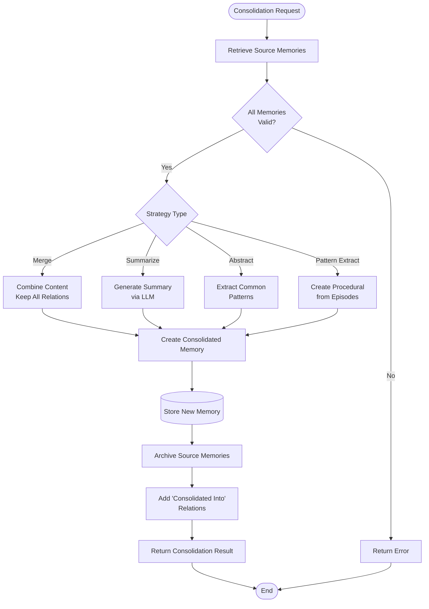

## Cross-Surface Sync Flow

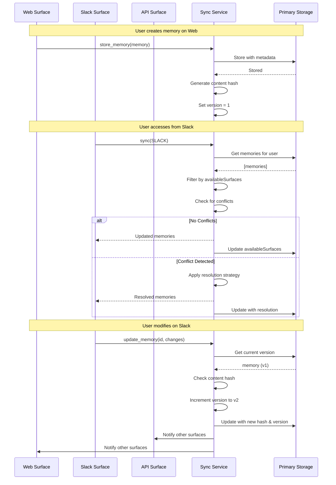

## Memory Relationship Graph

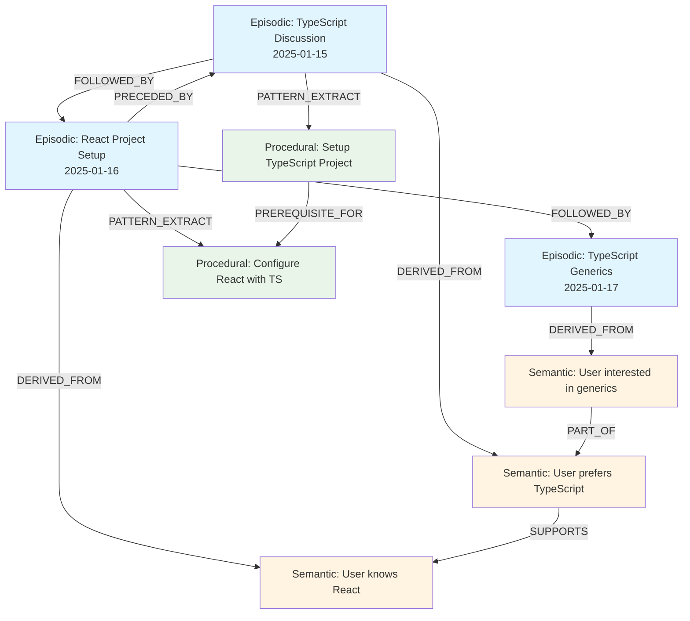

## Embedding and Semantic Search

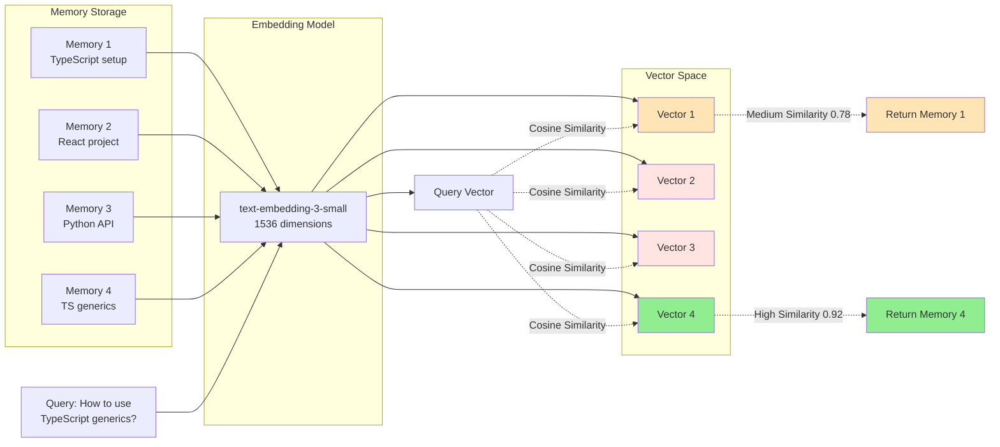

## Complete Data Flow

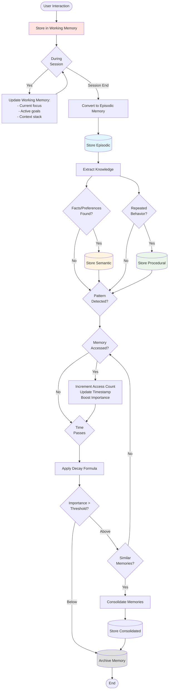

## Performance Optimization Strategy

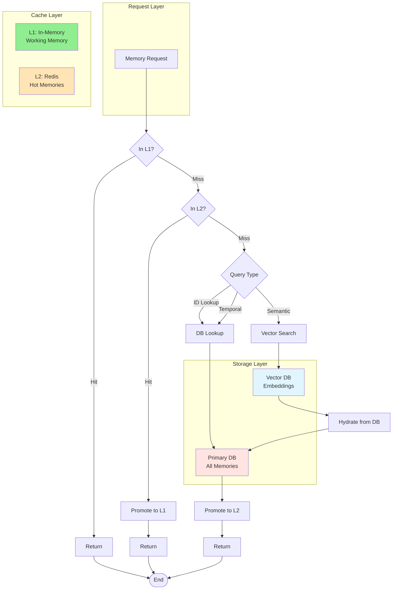
